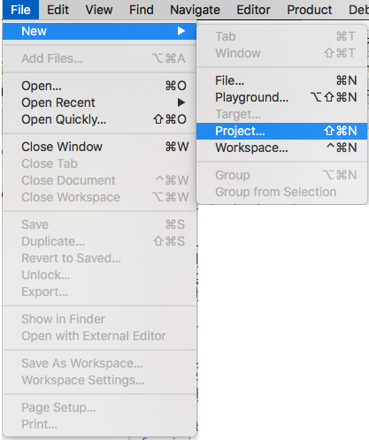
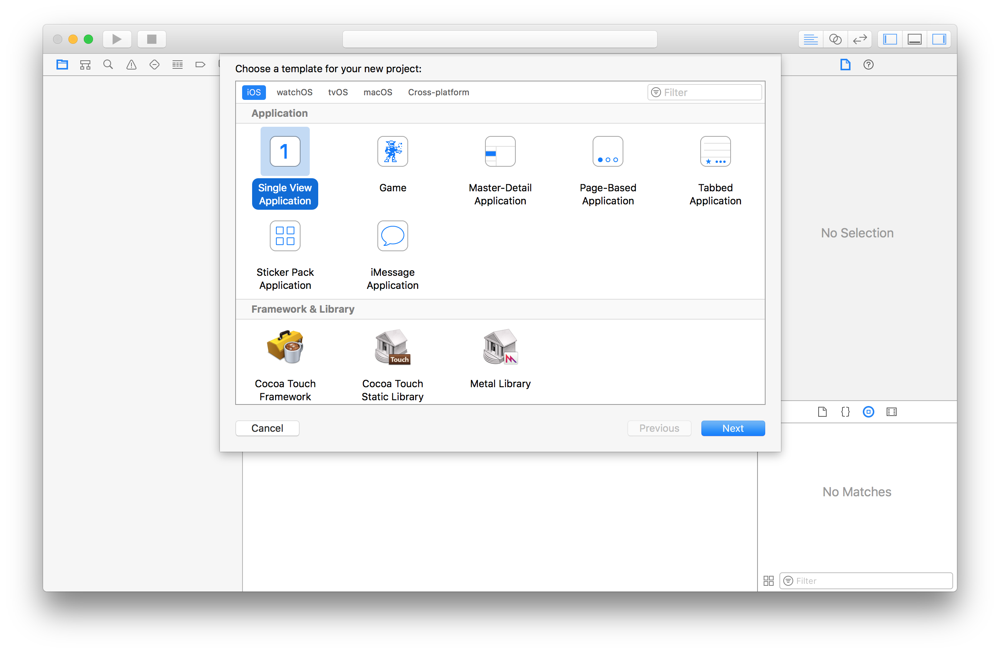
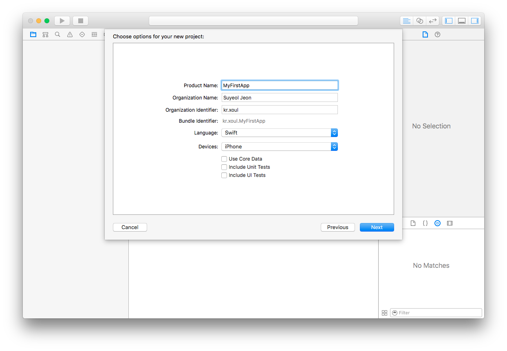
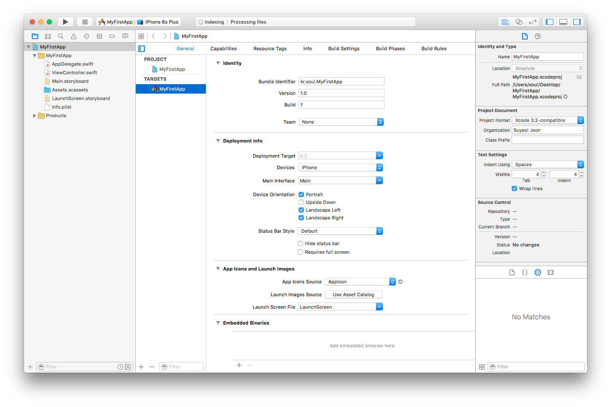
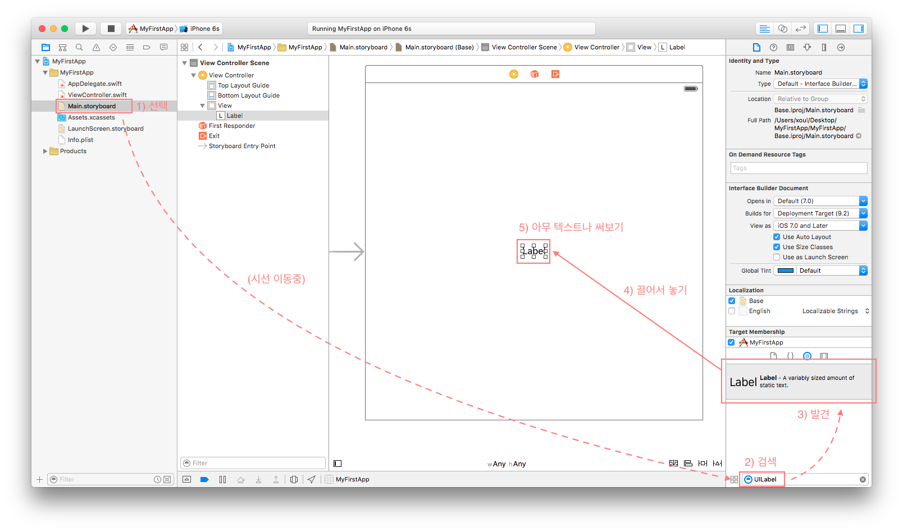

## 첫 iOS 프로젝트 시작해보기

이번에는 진짜 iOS 프로젝트를 한 번 생성해봅시다. Xcode 첫 화면에서 'Create a new Xcode project'를 선택하거나, 혹은 상태바의 **File → New → Project**를 선택하면 새로운 프로젝트를 만들 수 있습니다.

새로운 프로젝트가 사용할 템플릿을 고를 수 있는데요. iOS, OS X, watchOS, tvOS 등 다양한 플랫폼을 개발하기 위한 프로젝트 템플릿들이 준비돼있습니다. 우리는 iOS 애플리케이션을 개발할 것이므로 iOS의 Single View Application을 선택해주세요.

다음으로 보이는 화면은 Playground를 생성할 때보다는 입력할 곳이 더 많아진 화면입니다. 각 항목들은 프로젝트 생성 후 언제든지 수정할 수 있습니다.

* **Product Name**: 프로젝트 이름입니다. 프로젝트 생성 후 따로 설정하지 않으면 이 값이 앱 이름으로 사용됩니다. 앱 이름을 나중에 따로 설정할 수 있으므로 UpperCamelCase로 작성하는 것을 권장합니다.
* **Organization Name**: 소스코드 상단에 자동으로 추가되는 Copyright 텍스트를 생성하는데 사용됩니다.
* **Organization Identifier**: Bundle Identifier를 생성하는데 사용되는 prefix입니다. `kr.xoul`과 같이 도메인을 뒤집어서 사용하는 것이 관례입니다.
* **Bundle Identifier**: 전세계 모든 앱이 가지는 고유한 식별자입니다. Organization Identifier와 ProductName을 합친 문자열을 사용하는 것이 관례입니다.
* **Language**: Swift와 Objective-C로 개발할 수 있습니다. 우리는 Swift를 선택해야죠.
* **Devices**: 애플리케이션이 구동되는 기기입니다. iPhone, iPad, Universal을 선택할 수 있는데요. 차이는 '전용'인지 아닌지라고 생각하면 됩니다. iPhone 전용으로 만들어진 앱도 iPad에서 구동되지만, 해상도와 레이아웃은 iPhone을 따라갑니다.
* **Use Core Data**: Core Data는 디스크에 저장되는 모델링 프레임워크입니다. 우린 이거 안쓸거예요.
* **Include Unit Tests**: 유닛테스트 타겟을 자동으로 생성할지를 선택합니다. 나중에 추가할 수 있으니 걱정마세요.
* **Include UI Tests**: Xcode 7 버전부터는 UI 테스트가 굉장히 쉬워졌는데, 유닛테스트와 마찬가지로 나중에 추가할 수 있으니 체크해제하고 갑시다. 처음부터 많으면 머리아파요.

그 다음 화면은 프로젝트를 생성할 디렉토리를 설정하는 화면인데요. 'Create Git repository on'에 체크하면 프로젝트 생성과 동시에 Git repository를 생성해줍니다. 무슨 말인지 모르는 사람들은 체크해제하고 넘어가요. 주제에서 벗어나므로 Git에 대해서는 다루지 않을 예정이거든요.

드디어 프로젝트가 생성됐습니다. 복잡하죠? 쓰다보면 익숙해질 거예요. Xcode의 가장 왼쪽 위에 있는   버튼을 한 번 눌러볼까요? 오래된 맥에서는 비행기 이륙하는 소리가 조금 날 수 있습니다.

화면 가운데 위와 같은 메시지가 보이면 빌드에 성공한 것입니다.

그리고 잠시 뒤 짠! 아이폰 시뮬레이터가 실행됐습니다. 왜 흰 화면이냐고요? 아무것도 안썼으니까요. 시뮬레이터가 너무 커서 화면에 안들어올 때에는 ⌘1부터 ⌘5까지를 차례대로 눌러보세요. 시뮬레이터 크기를 조절할 수 있답니다. 상태바의 **Window → Scale**에서도 설정할 수 있어요. 

### 인터페이스 빌더에서 아무거나 만져보기

이번에는 왼쪽 네비게이터에 있는 **`Main.storyboard`** 파일을 선택하여 열어봅시다. 그리고 오른쪽 아래에서 `UILabel`을 검색하여 나오는 **Label**을 끌어서 화면 가운데로 놓아봅시다. 그리고 추가된 라벨을 더블클릭하여 원하는 텍스트를 입력해봐요.

그런 다음 아까와 같이   버튼을 눌러서 실행시켜보면...

뭔가 이상하죠? 일단 이상한대로 냅두세요. 고칠 수 있으면 고쳐봐도 좋고요! 일단은 아무거나 막 만져보는게 중요합니다.

방금 우리가 추가한 것이 `UILabel`이라고 하는 것인데요. iOS에서 텍스트를 보여주는 가장 기본적인 컴포넌트입니다. iOS 컴포넌트에 대해서는 [3강 - iOS 기본 컴포넌트 다루기](../Chapter-3//)에서 더 자세하게 다룰 예정이니 너무 조급해하지 않으셔도 됩니다.
