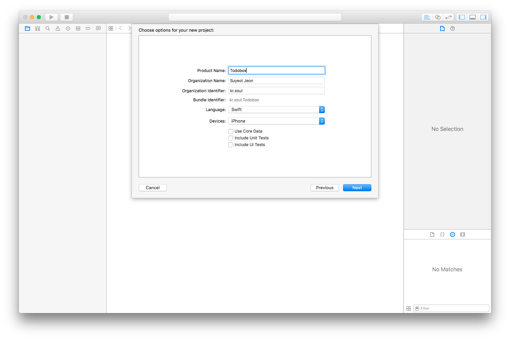
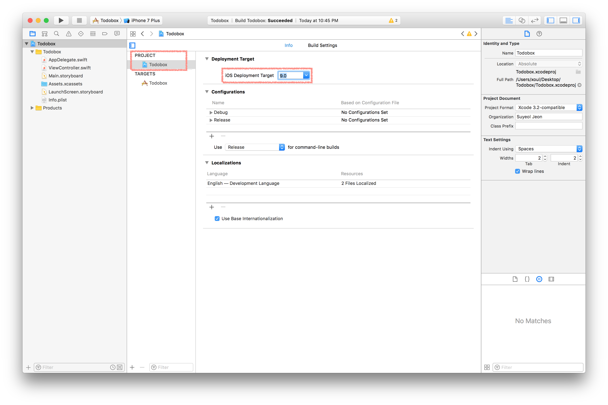

# 4강 - 할 일 목록 관리 앱 Todobox 만들기 (1)

지금까지 Swift 문법에 대해 알아보았습니다. 빨리 실제로 써보고 싶어서 몸이 근질근질하죠? 이제는 진짜로 앱을 만들어봅시다.

처음으로 만들어볼 애플리케이션은 할 일 목록을 관리해주는 'Todobox'입니다.

Todobox를 만들면서 배우게 될 내용은 다음과 같습니다.

- 스토리보드에서 만든 컴포넌트를 Swift 코드와 연결하기 (@IBOutlet, @IBAction)
- 테이블 뷰에 데이터를 보여주고, 추가/삭제/변경하기 (UITableView)
- 네비게이션 컨트롤러 (UINavigationController)
- 바 버튼 아이템 (UIBarButtonItem)
- 기기에 데이터 저장하고 꺼내오기 (NSUserDefaults)
- 텍스트 필드 (UITextField)
- 텍스트 뷰 (UITextView)

완성된 Todobox 앱의 소스코드와 커밋로그는 [GitHub](https://github.com/devxoul/Todobox)에서 볼 수 있습니다.

## 새 프로젝트 시작하기

우선, [1강에서 했던 것처럼](../Chapter-1/ios-project.html) Xcode에서 새로운 iOS 프로젝트를 생성해봅시다. Product Name에는 'Todobox'를 쓰고, Swift 언어를 선택한 뒤 다음을 눌러 프로젝트가 저장될 디렉토리를 설정합니다.

### 배포 타겟 설정하기

Xcode에서 프로젝트가 열리면, 가장 먼저 화면 왼쪽에 있는 프로젝트 네비게이터Project Navigator에서 'Todobox'라는 프로젝트를 선택해봅시다. 그리고 나오는 화면에서 Project 아래에 있는 Todobox를 선택하여 Deployment Target을 8.0으로 변경합니다. 기본값으로는 Xcode에서 지원하는 가장 최신 버전의 iOS가 선택되어 있는데, 우리는 iOS 8 이상을 지원하도록 합니다.

이제 가장 기본적인 프로젝트 환경은 끝났습니다. 이제부터는 사용자가 실제로 사용할 수 있는 UI를 만들어 봅시다.
