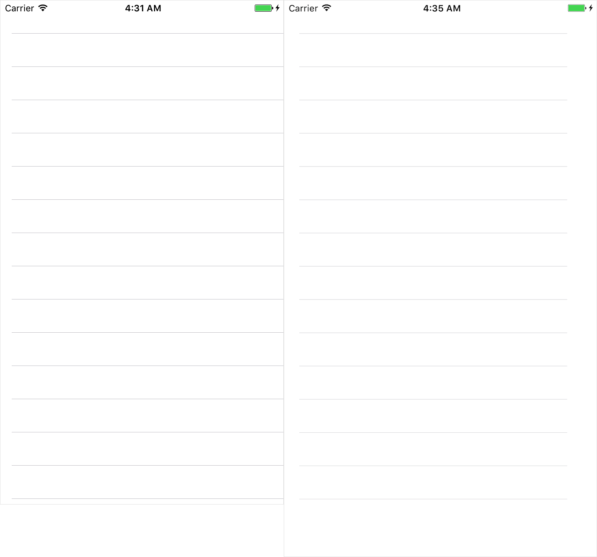

## 테이블 뷰 다루기

*테이블 뷰Table View*는 데이터를 목록 형태로 보여줄 수 있는 가장 기본적인 컴포넌트 단위입니다. 연락처, 음악 등 대부분의 앱에서 테이블 뷰를 활용하고 있습니다. 다른 플랫폼에서는 '리스트 뷰'와 같은 이름을 사용하곤 하는데, iOS에서는 '테이블 뷰'라는 이름을 사용합니다. 그렇다고 해서 열column을 가지고 있지는 않습니다. 조금 낯설죠?

### 스토리보드 (Storyboard)

어쨌거나, 애플에서 테이블 뷰라고 했으니 테이블 뷰라고 합시다. 우리는 *인터페이스 빌더Interface Builder*에서 테이블 뷰를 추가할 것인데요. 인터페이스 빌더는 드래그 앤 드랍으로 사용자 인터페이스를 구성할 수 있게 해주는 직관적인 도구입니다. 화면의 흐름과, 화면에 들어가는 컴포넌트를 손쉽게 구성할 수 있습니다.

iOS 프로젝트에서는 기본적으로 **`Main.storyboard`**라는 기본 스토리보드 파일을 제공합니다. 바로 아래에는 **`LaunchScreen.storyboard`**라는 스토리보드가 하나 더 있는데요. **`Main.storyboard`**는 앱에서의 전체 화면을 담고 있고, **`LaunchScreen.storyboard`**는 앱이 실행되기 전에 보이는 스플래시Splash 화면을 담고 있습니다. **`LaunchScreen.storyboard`**을 다루는 것은 따로 다루지 않을 예정입니다.

이제 **`Main.storyboard`** 파일을 선택해서 열어봅시다. 'View Controller'라고 적힌 큰 사각형이 하나 보이고, 그 사각형을 가리키는 화살표가 하나 있네요. *뷰 컨트롤러View Controller*는 iOS 앱에서 사용되는 화면 단위라고 이해하면 쉽습니다. 꼭 그렇지만은 않을 수도 있는데요. 일단은 그렇게 이해하는게 편하니 넘어갑시다. 그리고 화살표는 앱이 실행되면 처음 보여지는 화면이라는 것을 나타냅니다.

### 테이블 뷰 추가하기

1강에서 **Label**을 화면에 추가해본 적이 있죠? 이번에는 같은 방법으로 **Table View**를 화면에 끌어다 놓습니다. 유의할 점은, **Table View Controller**가 아니고 **Table View**여야 합니다. 바로 위에서 뷰 컨트롤러는 화면의 단위라고 했죠? *테이블 뷰 컨트롤러Table View Controller*는 테이블 뷰를 기본으로 가지고 있는 화면입니다.

우리는 기본으로 테이블 뷰를 가지고 있는 테이블 뷰 컨트롤러를 사용하는 대신에, 일반 뷰 컨트롤러에 테이블 뷰를 직접 추가할 거예요.

덩그러니 있으니 좀 허전하죠? 방금 추가한 테이블 뷰를 화면에 꽉 채워봅시다. 그리고 iPhone 7 시뮬레이터와 iPhone 7 Plus 시뮬레이터로 각각 실행해봅시다.

뭔가 다른 것을 느꼈나요? 만약 다른 점을 발견했다면 UI 개발자가 되기에 좋은 눈썰미를 가지고 있다고 볼 수 있겠습니다. 만약 발견하지 못했다면 발견한 척 합시다.

다른 점은 바로 테이블 뷰 크기가 화면 크기에 맞게 늘어나지 않았다는 점입니다. iPhone 7 시뮬레이터로 돌렸을 때에는 화면에 꽉 차던 테이블 뷰가, iPhone 7 Plus 시뮬레이터를 사용했더니 iPhone 7 영역만큼만 채워지고 화면 오른쪽과 아래쪽에는 공백이 생겨버렸습니다. 이 현상은 아이폰의 해상도가 다양해지면서 생겼습니다. 우리가 스토리보드에서 만들었던 테이블 뷰는 4.7인치 화면을 기준으로 크기를 정했기 때문에, 5.5인치 화면에서는 4.7인치짜리 테이블 뷰를 보게 되는 것이지요.

여러 해상도에 대응하기 위해 애플에서는 *오토 레이아웃Auto Layout*이라는 것을 만들었습니다. 어떤 뷰의 위치와 크기를 절대 수치로 직접 넣지 않고, 관계만을 정의하는 것이죠. 해상도가 다양해지기 전에는 테이블 뷰를 화면에 꽉 채우기 위해서 x, y 좌표를 (0, 0)으로 두고 가로와 세로 크기를 320과 480으로 뒀습니다. 하지만 오토 레이아웃이 사용되면서 부터는 상하좌우를 0으로 만들어버리는 방식을 사용합니다. 화면 위쪽까지의 거리가 0이고, 화면 아래쪽까지의 거리도 0이라면 이 뷰의 높이는 화면 높이와 같아지는 원리죠.

오토 레이아웃을 정의할 때에는 *제약Constraint*을 만듭니다. 상하좌우 거리를 0으로 만드는 제약을 테이블 뷰에 걸어버리는 것이죠. 스토리보드에서는 핀Pin 버튼()을 사용해서 오토 레이아웃 제약을 추가할 수 있습니다.

스토리보드에 있는 테이블 뷰를 선택한 뒤 핀 버튼을 클릭해봅시다. 그리고 왼쪽 그림처럼 나오는 값들을 오른쪽과 같이 모두 0으로 바꾸고, 상하좌우 점선을 클릭하여 실선으로 바꿔봅니다.

그 다음, 'Add 4 Constraints' 버튼을 선택하여 4개의 제약을 추가합니다. 상하좌우 모두 0으로 만들었는데, 각각 하나의 제약이기 때문에 총 4개의 제약이 됩니다. 오토 레이아웃 제약을 추가하면 스토리보드 왼쪽에 파란색으로 4개의 제약이 추가된 것을 확인할 수 있습니다.

테이블 뷰 크기와 위치를 아무렇게나 조절해보면 노란색 줄이 생기는데요. 오토 레이아웃 제약에서는 상하좌우가 모두 0인데 스토리보드상 테이블 뷰의 좌표가 다르기 때문에 차이가 난다고 알려주는 것입니다. 이상태로 실행해도 정상적으로 작동되는데, 보고 있으면 찜찜하기 때문에 테이블 뷰를 선택하여 크기를 다시 늘려줍니다.

그리고 나서 아까와 같이 iPhone 7 시뮬레이터와 iPhone 7 Plus 시뮬레이터에서 각각 실행해봅시다. 이제 정상적으로 나오는 것을 볼 수 있습니다.
